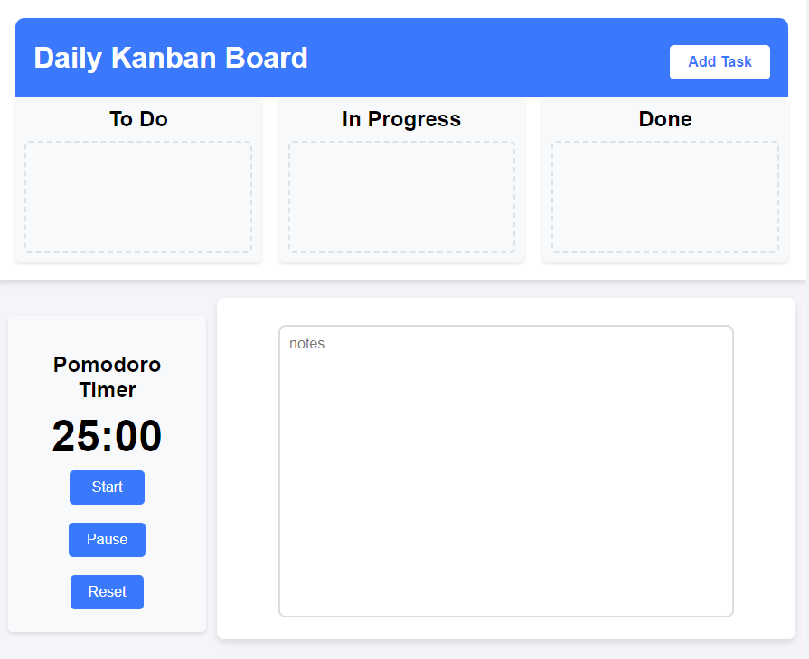
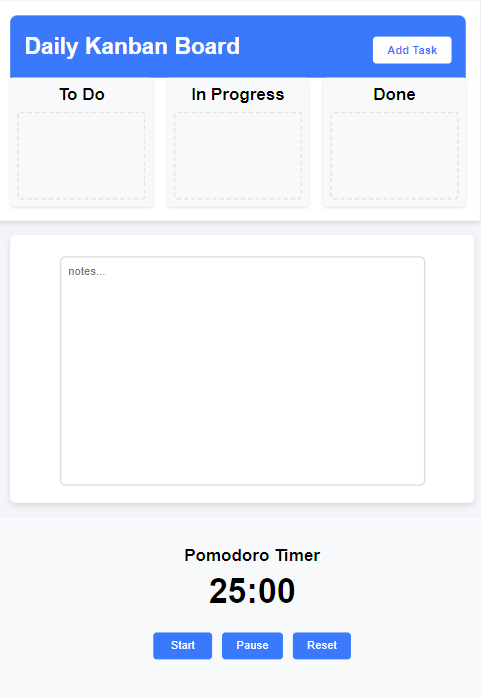

# Personal Kanban Board with Pomodoro Timer

## Table of contents

- [Overview](#overview)
  - [Screenshot](#screenshot)
  - [Links](#links)
- [My process](#my-process)
  - [Built with](#built-with)
  - [Featured Sections](#featured-sections)
  - [Continued development](#continued-development)
  - [Useful resources](#useful-resources)
- [Contributing](#contributing)
- [License](#license)
- [Author](#author)

## Overview

Users should be able to:

- **PERSONAL KANBAN with a Pomodoro Timer**: Use Kanban board and set a timer
- A local storage natepad
- A 30 minute reminder to stand and drink water


### Screenshot





### Links

- Repo URL: [github.com/SteveNoyes/personal-kanban-board](https://github.com/SteveNoyes/personal-kanban-board)
- Live Site URL: [https://stevenoyes.github.io/personal-kanban-board/](https://stevenoyes.github.io/personal-kanban-board/)

## My process

### Built with

- Semantic HTML5 markup
- CSS custom properties
- Flexbox
- CSS Grid
- Mobile-first workflow
- JavaScript

### Featured Sections

To see how you can add code snippets, see below:

```html
<div class="kanban-container">
  <header>
      <h1>Daily Kanban Board</h1>
      <button id="add-task-btn">Add Task</button>
  </header>
  <div class="kanban-board">
      <div class="kanban-column" id="todo" data-status="To Do">
          <h2>To Do</h2>
          <div class="kanban-tasks"></div>
      </div>
      <div class="kanban-column" id="in-progress" data-status="In Progress">
          <h2>In Progress</h2>
          <div class="kanban-tasks"></div>
      </div>
      <div class="kanban-column" id="done" data-status="Done">
          <h2>Done</h2>
          <div class="kanban-tasks"></div>
      </div>
  </div>
```

```css
  @media only screen and (max-width: 1443px) {
    .pomodoro-container {
      height: 250px !important;
    }
    #reset-timer {
      margin-top: 20px;
    }
  }

  @media only screen and (max-width: 958px) {
    .pomodoro-container {
      height: 310px !important;
    }
    #start-timer {
      margin-bottom: 20px;
    }
  }

  @media only screen and (max-width: 846px) {
    .pomo-and-note-wrapper {
      display:block !important;
      flex-direction: row-reverse !important;
    }
    .pomodoro-container {
      width: 100% !important;
      max-width: 100% !important;
    }
    .notepad-container {
      max-width: 90% !important;
      margin-left: 3% !important;
    }
    .desktop-wrapper {
      display: none !important;
    }
    .tablet-wrapper {
      display: inline !important;
    }
  }
```

```js

  // Reminder message
  function showReminder() {
    alert("Stand Up and Drink Water");
  }

  // Fimer to alert user every 30 minutes (30 minutes = 1800000 milliseconds)
  window.onload = function() {
    setInterval(showReminder, 1800000);
  };

```

### Continued development

### Useful resources

- [Placeholder Image](https://placehold.co/600x400) - Placeholder image. 
- [The Markdown Guide](https://www.markdownguide.org/) - If you want more help with writing markdown, we'd recommend checking out this site.

## Contributing

- If you'd like to contribute to this project, feel free to fork the repository and submit a pull request. Here's how you can contribute:

- Fork the repository.
- Create a new branch (git checkout -b feature-name).
- Make your changes.
- Commit your changes (git commit -am 'Add new feature').
- Push to your forked repository (git push origin feature-name).
- Create a new pull request.

## License

- Copyright 

-Permission is hereby granted, free of charge, to any person obtaining a copy of this software and associated documentation files (the "Software"), to deal in the Software without restriction, including without limitation the rights to use, copy, modify, merge, publish, distribute, sublicense, and/or sell copies of the Software, and to permit persons to whom the Software is furnished to do so, subject to the following conditions:

-The above copyright notice and this permission notice shall be included in all copies or substantial portions of the Software.

-THE SOFTWARE IS PROVIDED "AS IS", WITHOUT WARRANTY OF ANY KIND, EXPRESS OR IMPLIED, INCLUDING BUT NOT LIMITED TO THE WARRANTIES OF MERCHANTABILITY, FITNESS FOR A PARTICULAR PURPOSE AND NONINFRINGEMENT. IN NO EVENT SHALL THE AUTHORS OR COPYRIGHT HOLDERS BE LIABLE FOR ANY CLAIM, DAMAGES OR OTHER LIABILITY, WHETHER IN AN ACTION OF CONTRACT, TORT OR OTHERWISE, ARISING FROM, OUT OF OR IN CONNECTION WITH THE SOFTWARE OR THE USE OR OTHER DEALINGS IN THE SOFTWARE.

## Author

- Website - [Steven Noyes](https://www.stevenmnoyes.com)