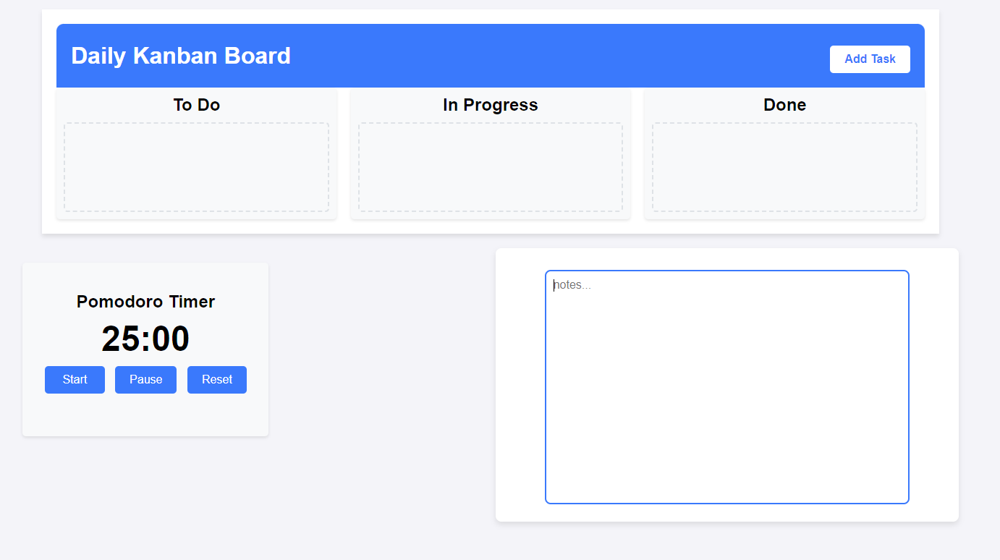

# Frontend Mentor - Personal Kanban Board with Pomodoro Timer

## Table of contents

- [Overview](#overview)
  - [Usage](#usage)
    - [Scheduling a Post](#scheduling-a-post)
    - [Viewing Scheduled Posts](#viewing-scheduled-posts)
    - [Auto Publish](#auto-publish)
  - [Screenshot](#screenshot)
  - [Links](#links)
- [My process](#my-process)
  - [Built with](#built-with)
  - [Featured Sections](#featured-sections)
  - [Continued development](#continued-development)
  - [Useful resources](#useful-resources)
- [Contributing](#contributing)
- [License](#license)
- [Author](#author)

## Overview

Users should be able to:

- **PERSONAL KANBAN with a Pomodoro Timer**: PERSONAL KANBAN with a Pomodoro Timer.
- View the optimal layout for the interface depending on their device's screen size
- SINGLE PAGE APP


### Usage

- Schedule Posts: Write content, choose a platform (Twitter/Facebook), and set a time for posting.
- View Scheduled Posts: See upcoming scheduled posts with the ability to publish or delete them.
- Auto Publish: Posts are automatically published when their scheduled time arrives.
- Mock Social Media Post: Publish posts to Twitter or Facebook (mocked for this example).

#### Scheduling a Post

- To schedule a post:
- Enter the content you want to post in the textarea.
- Choose the platform (Twitter or Facebook).
- Select the time you want the post to be published.
- Click the Schedule Post button.

#### Viewing Scheduled Posts
- All scheduled posts will appear below the form. Each post will show:
- The platform (Twitter or Facebook)
- The scheduled time
- The content of the post
- You can:
- Publish Now: Publish the post immediately.
- Delete: Remove the post from the schedule.

#### Auto Publish
- Scheduled posts will automatically be published once their time arrives. A background process checks the scheduled times every second and triggers the publish action when necessary.

### Screenshot




### Links

- Repo URL: [github.com/SteveNoyes/personal-kanban-board](https://github.com/SteveNoyes/personal-kanban-board)
- Live Site URL: []()

## My process

### Built with

- Semantic HTML5 markup
- CSS custom properties
- Flexbox
- CSS Grid
- Mobile-first workflow
- JavaScript

### Featured Sections

To see how you can add code snippets, see below:

```html

```

```css

```

```js

```

### Continued development

### Useful resources

- [Placeholder Image](https://placehold.co/600x400) - Placeholder image. 
- [The Markdown Guide](https://www.markdownguide.org/) - If you want more help with writing markdown, we'd recommend checking out this site.

## Contributing

- If you'd like to contribute to this project, feel free to fork the repository and submit a pull request. Here's how you can contribute:

- Fork the repository.
- Create a new branch (git checkout -b feature-name).
- Make your changes.
- Commit your changes (git commit -am 'Add new feature').
- Push to your forked repository (git push origin feature-name).
- Create a new pull request.

## License

- Copyright 

-Permission is hereby granted, free of charge, to any person obtaining a copy of this software and associated documentation files (the "Software"), to deal in the Software without restriction, including without limitation the rights to use, copy, modify, merge, publish, distribute, sublicense, and/or sell copies of the Software, and to permit persons to whom the Software is furnished to do so, subject to the following conditions:

-The above copyright notice and this permission notice shall be included in all copies or substantial portions of the Software.

-THE SOFTWARE IS PROVIDED "AS IS", WITHOUT WARRANTY OF ANY KIND, EXPRESS OR IMPLIED, INCLUDING BUT NOT LIMITED TO THE WARRANTIES OF MERCHANTABILITY, FITNESS FOR A PARTICULAR PURPOSE AND NONINFRINGEMENT. IN NO EVENT SHALL THE AUTHORS OR COPYRIGHT HOLDERS BE LIABLE FOR ANY CLAIM, DAMAGES OR OTHER LIABILITY, WHETHER IN AN ACTION OF CONTRACT, TORT OR OTHERWISE, ARISING FROM, OUT OF OR IN CONNECTION WITH THE SOFTWARE OR THE USE OR OTHER DEALINGS IN THE SOFTWARE.

## Author

- Website - [Add your name here](https://www.your-site.com)
- Twitter - [@yourusername](https://www.twitter.com/yourusername)